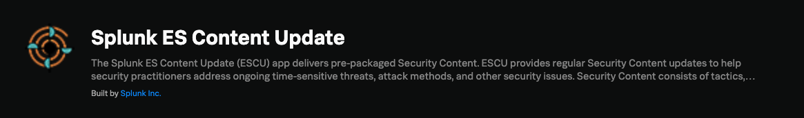

</p>
<p align="center">
    <a href="https://github.com/splunk/security_content/releases">
        </a>
    <a href="https://github.com/splunk/security_content/actions/workflows/build.yml/badge.svg?branch=develop">
        </a>
    <a href="https://github.com/splunk/security_content">
        </a>
    <a href="https://github.com/splunk/security_content">
        </a>
    <a href="https://github.com/splunk/security_content">
        </a>
    <a href="https://github.com/splunk/security_content/graphs/contributors" alt="Contributors">
        </a>
    <a href="https://github.com/splunk/security_content/stargazers">
        </a>
</p>


# Splunk Security Content

=====

Welcome to the Splunk Security Content

This project gives you access to our repository of Analytic Stories, security guides that provide background on tactics, techniques and procedures (TTPs), mapped to the MITRE ATT&CK Framework, the Lockheed Martin Cyber Kill Chain, and CIS Controls. They include Splunk searches, machine learning algorithms and Splunk Phantom playbooks (where available)—all designed to work together to detect, investigate, and respond to threats.

**Note:** We have sister projects that enable us to build the industry's best security content. These projects are the Splunk Attack Range, an attack simulation lab built around Splunk, and Contentctl, the tool that enables us to build, test, and package our content for distribution.

# Tools 🧰

- [Splunk Attack Range](https://github.com/splunk/attack_range): The Splunk Attack Range is an open-source project maintained by the Splunk Threat Research Team. It builds instrumented cloud (AWS, Azure) and local environments (Virtualbox), simulates attacks, and forwards the data into a Splunk instance. This environment can then be used to develop and test the effectiveness of detections.
- [Contentctl](https://github.com/splunk/contentctl): The tool that enables us to build, test, and package our content for distribution.
- [Attack data](https://github.com/splunk/attack_data): The is a collection of attack data that is used to test our content.
- [Atomic Red Team](https://github.com/redcanaryco/atomic-red-team): Atomic Red Team™ is a library of tests mapped to the MITRE ATT&CK® framework. Security teams can use Atomic Red Team to quickly, portably, and reproducibly test their environments.

# Get Content🛡
The latest Splunk Security Content can be obtained via:
 
#### 🌐 [Website](https://research.splunk.com/)

Best way to discover and access our content is by using the [research.splunk.com](https://research.splunk.com/) website.

#### 🖥️ [Splunk Enterprise Security (ES) Content Update](https://docs.splunk.com/Documentation/ES/latest/Admin/Usecasecontentlibrary?#Update_the_Analytic_Stories)

Splunk security content ships as part of ESCU directly into, if you are an ES user, good news, you already have it!

#### 📦 [ESCU App](https://github.com/splunk/security_content/releases)

To manually download the latest release of Splunk Security Content (named DA-ESS-ContentUpdate.spl), you can visit the [splunkbase](https://splunkbase.splunk.com/app/3449/) page or the [release page](https://github.com/splunk/security_content/releases) on GitHub.

# Getting Started 🛠️

Follow these steps to get started with Splunk Security Content.

1. Clone this repository using `git clone https://github.com/splunk/security_content.git`
2. Navigate to the repository directory using `cd security_content`
3. Install contentctl using `pip install contentctl` to install the latest version of contentctl, this is a pre-requisite to validate, build and test the content like the Splunk Threat Research team

# Quick Start 🚀

1. Setup the environment
```
git clone https://github.com/splunk/security_content.git
cd security_content
python3.11 -m venv .venv
source .venv/bin/activate
pip install contentctl

```
2. Create a new **detection.yml** and answer the questions
 ```
 contentctl new
 ```


**NOTE** - Make sure you update the detection.yml with the required fields and values. If you need help, please refer to the [yaml-spec](docs/yaml-spec) to check out the list of allowed values

4. Validate your content
```
contentctl validate
```
**NOTE** - The contentctl validate command ensures that all YAML files adhere to the defined specifications and are up-to-date. It checks for required fields, correct data types, and overall consistency, helping maintain the integrity and quality of the content.

5. Build an ESCU app with enrichments from Atomic Red Team and Mitre CTI repositories
```
contentctl build --enrichments
```

6. Test the content - Our testing framework is based on [contentctl](https://github.com/splunk/contentctl) and is extensive and flexible. Refer to the [contentctl test documentation](https://github.com/splunk/contentctl?tab=readme-ov-file#contentctl-test) to learn more about the testing framework.


# Recommendations 💡

- 🚨 NOTE: If you are just getting started with managing your Splunk detection as code, we recommend that you keep the YAML structure of the detections as close as possible to the original structure of the detections. This will make it easier to manage your detections and will also make it easier to contribute back to the community by creating a pull request to the Splunk Security Content project.

- In order to build an content app that specific for your organization, we strongly recommend that you start with keeping only the detections that are related to your organization and remove other yamls that are not related to your organization. This includes selecting detections, stories, macros, lookups that are used by the detection ymls.

- If your detections are using macros and lookups, please make sure that you have the same macros and lookups in those directories.. This will ensure that the content app is self-contained and does not rely on external files.

- We recommend that you follow the errors produced by the `contentctl` tool while developing this content. The errors are descriptive enough to guide you in getting the right values. If you need help, please open a GitHub issue in the `contentctl` repository or refer to the [yaml-spec](docs/yaml-spec) to check out the list of allowed values


# YAML Specs 📄

YAML specs define the structure and required fields for various YAML configuration files used in the project. These specifications ensure consistency and validation across different types of YAML files, such as macros, lookups, and analytic stories. Each spec outlines the expected data types, descriptions, and whether the fields are mandatory, providing a clear schema for developers to follow.

- [detection](https://github.com/splunk/security_content/blob/develop/docs/yaml-spec/detection_spec.yml)
- [stories](https://github.com/splunk/security_content/blob/develop/docs/yaml-spec/stories_spec.yml)
- [macros](https://github.com/splunk/security_content/blob/develop/docs/yaml-spec/macros_spec.yml)
- [lookups](https://github.com/splunk/security_content/blob/develop/docs/yaml-spec/lookups_spec.yml)

# Content Parts 🧩

* [detections/](detections/): Contains all detection searches to-date and growing.
* [stories/](stories/): All Analytic Stories that are group detections or also known as Use Cases
* [deployments/](deployments/): Configuration for the schedule and alert action for all content
* [playbooks/](playbooks/): Incident Response Playbooks/Workflow for responding to a specific Use Case or Threat.
* [baselines/](baselines/): Searches that must be executed before a detection runs. It is specifically useful for collecting data on a system before running your detection on the collected data.
* [investigations/](investigations/): Investigations to further analyze the output from detections. For more information, you can refer to the [Splunk Enterprise Security documentation on timelines](https://docs.splunk.com/Documentation/ES/7.3.0/User/Timelines).
* [macros/](macros/): Implements Splunk’s search macros, shortcuts to commonly used search patterns like sysmon source type. More on how macros are used to customize content below.
* [lookups/](lookups/): Implements Splunk’s lookup, usually to provide a list of static values like commonly used ransomware extensions.
* [data_sources/](data_sources/): Defines the data sources, the necessary TA or App to collect them and the fields provided that can be used by the detections.


# MITRE ATT&CK ⚔️
### Detection Coverage
To view an up-to-date detection coverage map for all the content tagged with MITRE techniques visit: [https://mitremap.splunkresearch.com/](https://mitremap.splunkresearch.com/) under the **Detection Coverage** layer. Below is a snapshot in time of what technique we currently have some detection coverage for.

# Contribution 🥰
We welcome feedback and contributions from the community! Please see our [contributing to the project](./.github/CONTRIBUTING.md) for more information on how to get involved.

## Support 💪
If you are a Splunk Enterprise customer with a valid support entitlement contract and have a Splunk-related question, you can open a support case on the https://www.splunk.com/ support portal.

Please use the [GitHub Issue Tracker](https://github.com/splunk/security_content/issues) to submit bugs or feature requests using the templates to the Threat Research team directly.

If you have questions or need support, you can:

* Post a question to [Splunk Answers](http://answers.splunk.com)
* Join the [#security-research](https://splunk-usergroups.slack.com/archives/C1S5BEF38) room in the [Splunk Slack channel](http://splunk-usergroups.slack.com)

## License
Copyright 2022 Splunk Inc.

Licensed under the Apache License, Version 2.0 (the "License");
you may not use this file except in compliance with the License.
You may obtain a copy of the License at

http://www.apache.org/licenses/LICENSE-2.0

Unless required by applicable law or agreed to in writing, software
distributed under the License is distributed on an "AS IS" BASIS,
WITHOUT WARRANTIES OR CONDITIONS OF ANY KIND, either express or implied.
See the License for the specific language governing permissions and
limitations under the License.
