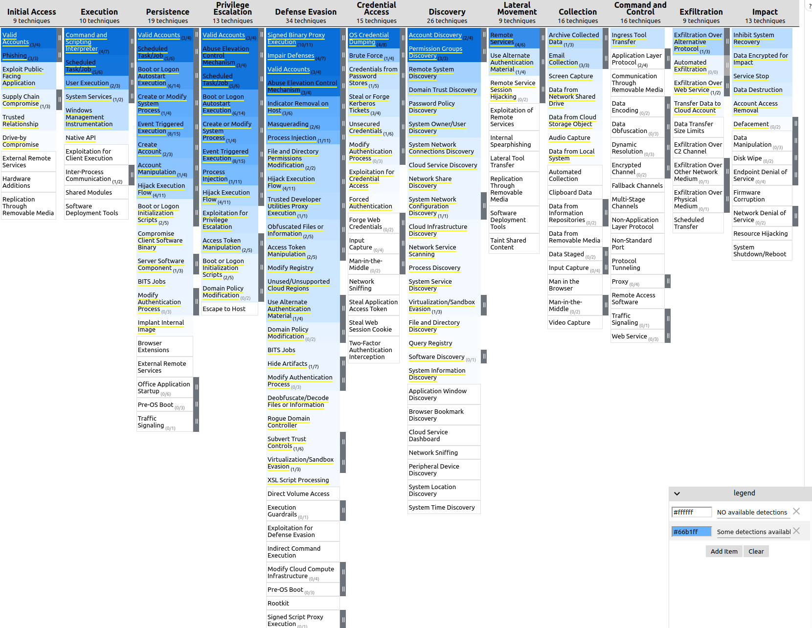
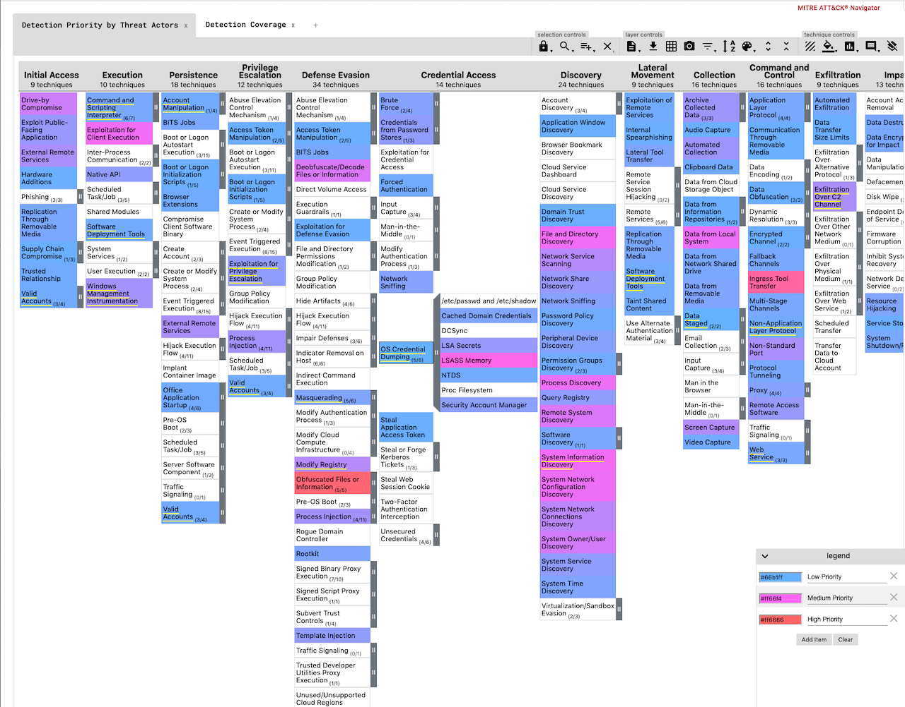

</p>
<p align="center">
    <a href="https://github.com/splunk/security_content/releases">
        </a>
    <a href="https://circleci.com/gh/splunk/security_content/tree/develop">
        </a>
    <a href="https://github.com/search?q=repo%3Asplunk%2Fsecurity_content+extension%3Ayml+path%3Adetections&type=Code&ref=advsearch&l=&l=">
        </a>
    <a href="https://github.com/splunk/security_content">
        </a>
    <a href="https://github.com/splunk/security_content">
        </a>
    <a href="https://github.com/splunk/security_content/graphs/contributors" alt="Contributors">
        </a>
    <a href="https://github.com/splunk/security_content/stargazers">
        </a>
</p>

# Splunk Security Content

=====

Welcome to the Splunk Security Content

This project gives you access to our repository of Analytic Stories that are security guides the provide background on TTPs, mapped to the MITRE framework, the Lockheed Martin Kill Chain, and CIS controls. They include Splunk searches, machine-learning algorithms, and Splunk Phantom playbooks (where available)—all designed to work together to detect, investigate, and respond to threats.

# Usage🛡
The Splunk Security Content can be used via:

#### [Splunk App](https://github.com/splunk/security_content/releases)
Grab the latest release of DA-ESS-ContentUpdate and install it on a Splunk Enterprise instance. Alternatively, you can download it from [splunkbase](https://splunkbase.splunk.com/app/3449/), it is currently a Splunk Supported App.

#### [API](https://docs.splunkresearch.com/?version=latest)
```
curl -s https://content.splunkresearch.com | jq
{
  "hello": "welcome to Splunks Research security content api"
}
```

#### [GitHub Workflow](https://github.com/splunk/security_content/wiki/Installation-and-Usage)
Create your customized version of Security Content by forking this project and following this [guide](https://github.com/splunk/security_content/wiki/Installation-and-Usage#github-workflow).

# MITRE ATT&CK
### Detection Coverage
To view an up-to-date detection coverage map for all the content tagged with MITRE techniques visit: [https://mitremap.splunkresearch.com/](https://mitremap.splunkresearch.com/) under the **Detection Coverage** layer. Below is a snapshot in time of what technique we currently have some detection coverage for. The darker the shade of blue the more detections we have for this particular technique. This map is automatically updated on every release and generated from the [generate-coverage-map.py](https://github.com/splunk/security_content/blob/develop/bin/generate-coverage-map.py).



### Detection Priority by Threat Actors
If curious about how the Threat Research team prioritizes what content to build refer to our **Detection Priority by Threat Actors** layer. Using the actor data from [MITRE CTI](https://github.com/mitre/cti) we add a point for every threat actor that uses a particular technique, and then subtract a point of every detection we have mapped to that technique. The resulting map below is how we prioritize what techniques and detections to focus on next. This map is automatically updated on every release and is generated by the [generate-actors-map.py](https://github.com/splunk/security_content/blob/develop/bin/generate-actors-map.py) script.



# Customize to your Environment 🏗
Customize your content to change how [often detections run](https://github.com/splunk/security_content/wiki/Customize-to-Your-Environment#customizing-scheduling-and-alert-actions-with-deployments), or what the right source type for [sysmon](https://github.com/splunk/security_content/wiki/Customize-to-Your-Environment#customizing-source-types-with-macros) in your environment is please follow this [guide](https://github.com/splunk/security_content/wiki/Customize-to-Your-Environment).  

# Writing Content 📓
Please see the Developing Content [guide](https://github.com/splunk/security_content/wiki/Developing-Content) for instructions.

# What's in an Analytic Story?
A complete use case, specifically built to detect, investigate, and respond to a specific threat like [Credential Dumping](https://github.com/splunk/security_content/blob/develop/stories/credential_dumping.yml) or [Ransomware](https://github.com/splunk/security_content/blob/develop/stories/ransomware.yml). A group of detections and a response make up an analytic story, they are associated with the tag `analytics_story: <name>`.  

# Execute an Analytic Story 🏃‍♀️
Download and install the latest version of [Splunk Analytic Story Execution](https://github.com/splunk/analytic_story_execution/releases). This Splunk application will help the user do the following:

1. Execute an analytic story in an ad-hoc mode and view the results.
2. Schedule all the detection searches in an analytic story.
3. Update security_content via an API

# Content Parts 🧩

* [detections/](detections/): Contains all 209 detection searches to-date and growing.
* [stories/](stories/): All Analytic Stories that are group detections or also known as Use Cases
* [deployments/](deployments/): Configuration for the schedule and alert action for all content
* [responses/](responses/): Incident Response Playbooks/Workflow for responding to a specific Use Case or Threat.
* [response_tasks/](response_tasks/): Individual steps in responses that help the user investigate via a Splunk search, automate via a phantom playbook, and visualize via dashboards threats.
* [baselines/](baselines/): Searches that must be executed before a detection runs. It is specifically useful for collecting data on a system before running your detection on the collected data.
* [dashboards/](dashboards/): JSON definitions of Mission Control dashboards, to be used as a response task. Currently not used.
* [macros/](macros/): Implements Splunk’s search macros, shortcuts to commonly used search patterns like sysmon source type. More on how macros are used to customize content below.
* [lookups/](lookups/): Implements Splunk’s lookup, usually to provide a list of static values like commonly used ransomware extensions.

#### Supporting Parts
* [package/](package/): Splunk content app-source files, including lookups, binaries, and default config files
* [bin/](bin/): All binaries required to produce and test content

# Contribution 🥰
We welcome feedback and contributions from the community! Please see our [contributing to the project](https://github.com/splunk/security_content/wiki/Contributing-to-the-Project) for more information on how to get involved.

## Support 💪
Please use the [GitHub Issue Tracker](https://github.com/splunk/security_content/issues) to submit bugs or request features.

If you have questions or need support, you can:

* Post a question to [Splunk Answers](http://answers.splunk.com)
* Join the [#security-research](https://splunk-usergroups.slack.com/archives/C1S5BEF38) room in the [Splunk Slack channel](http://splunk-usergroups.slack.com)
* If you are a Splunk Enterprise customer with a valid support entitlement contract and have a Splunk-related question, you can also open a support case on the https://www.splunk.com/ support portal


## License
Copyright 2020 Splunk Inc.

Licensed under the Apache License, Version 2.0 (the "License");
you may not use this file except in compliance with the License.
You may obtain a copy of the License at

http://www.apache.org/licenses/LICENSE-2.0

Unless required by applicable law or agreed to in writing, software
distributed under the License is distributed on an "AS IS" BASIS,
WITHOUT WARRANTIES OR CONDITIONS OF ANY KIND, either express or implied.
See the License for the specific language governing permissions and
limitations under the License.
