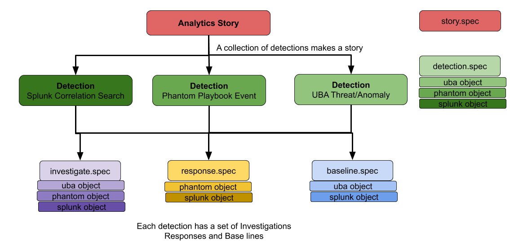

security-content 
=====
Contains a collection of topic-based security guides called "Analytic Stories," which are mapped to the MITRE ATT&CK Framework, Lockheed Martin Kill Chain phases, and CIS controls. They include corresponding detection, investigative, and support searches. The content here is packaged and shipped as part of the Splunk Enterprise Security Content Updates (ESCU). 

| branch | build status |
| ---    | ---          |
| develop| |
| master | |

# Usage
Can be consumed using:

#### [Splunk App](https://github.com/splunk/security-content/releases)
Grab the latest release of DA-ESS-ContentUpdate and install it on a Splunk Enterprise server (search head).

#### [API](https://github.com/splunk/security-content-api)
`curl https://g7jbilqdth.execute-api.us-west-2.amazonaws.com/api/`

#### [CLI](https://github.com/splunk/security-content-api/blob/master/content-update.py)
`python content-update.py -o $SPLUNK_HOME/etc/apps/DA-ESS-ContentUpdate --splunk_user admin --splunk_password xxxx`

# Writing Content
First, make sure to follow the steps to install **dependecies and pre-commit hook's** under [developing](https://github.com/splunk/security-content#developing) before you begin. 

1. Select the content [piece](https://github.com/splunk/security-content#content-parts) you want to write. 
2. Copy an example and edit it to suit your needs. At a minimum, you must write a [story](stories/), [a detection search](detections/), and an [investigative search](investigations/).
3. Make a pull request. If Circle CI fails, refer to [troubleshooting](https://github.com/splunk/security-content#troubleshooting).

# Security Content Layout

#### Content Parts
* [stories/](stories/): All Analytic Stories for ESCU
* [detections/](detections/): Splunk Enterprise, Splunk UBA, and Splunk Phantom detection searches that power Analytic Stories
* [investigations/](investigations/): Splunk Enterprise and Splunk Phantom investigative searches and playbooks employed by Analytic Stories
* [responses/](responses/): Automated Splunk Enterprise and Splunk Phantom responses used by Analytic Stories
* [baselines/](baselines/): Splunk Phantom and Splunk Enterprise baseline searches needed to support detection searches in Analytic Stories

#### Supporting parts
* [package/](package/): Splunk content app-source files, including lookups, binaries, and default config files
* [bin/](bin/): All binaries required to produce and test content

# Docs
* [docs/](docs/): Documentation for all spec files
* [spec/](spec/): All spec files that describe ESCU content

# Developing
##### dependecies and pre-commit hook's
Install project dependecies and tests that run before content is commited

1. Create virtualenv and install requirements: `virtualenv venv && source venv/bin/activate && pip install -r requirements.txt`.
2. Install `pre-commit install`.

##### CI tools
tools that help with testing CI jobs

1. Install CircleCi [CLI Tool](https://circleci.com/docs/2.0/local-cli/#installation).
2. To test a local change to CircleCi or build, make sure you are running Docker and then enter
`circleci local execute -e GITHUB_TOKEN=$GITHUB_TOKEN --branch <your branch>`

#### Generate docs from schema 
To generate docs from schema automatically

1. install https://github.com/adobe/jsonschema2md
2. Enter `jsonschema2md -d spec/v2/detections.json.spec -o docs`

# Troubleshooting
#### Our Automated Tests
1. [CI](https://github.com/splunk/security-content/blob/44946063173f7bc9921f0da0aa62139c084d1c51/.circleci/config.yml#L27) validates that the content was written to spec using [`validate.py`](https://github.com/splunk/security-content/blob/runstory/bin/generate.py). To run validation manually, execute: `python bin/generate.py --path . --output package --storiesv1 --use_case_lib -v`.
2. [CI](https://github.com/splunk/security-content/blob/44946063173f7bc9921f0da0aa62139c084d1c51/.circleci/config.yml#L60) generates Splunk configuration files using [`generate.py`](https://github.com/splunk/security-content/blob/develop/bin/generate.py). If you want to export Splunk .conf files manually from the content, run: `python bin/generate.py --path . --output package --storiesv1 --use_case_lib -v`.
3. [CI](https://github.com/splunk/security-content/blob/44946063173f7bc9921f0da0aa62139c084d1c51/.circleci/config.yml#L107) builds a DA-ESS-ContentUpdate Splunk package using the [Splunk Packaging Toolkit](http://dev.splunk.com/view/packaging-toolkit/SP-CAAAE9V). 
4. [CI](https://github.com/splunk/security-content/blob/44946063173f7bc9921f0da0aa62139c084d1c51/.circleci/config.yml#L145) tests the newly produced package using [Splunk Appinspect](http://dev.splunk.com/view/appinspect/SP-CAAAE9U).

# Todo's
* Build CLI for interacting and developing
